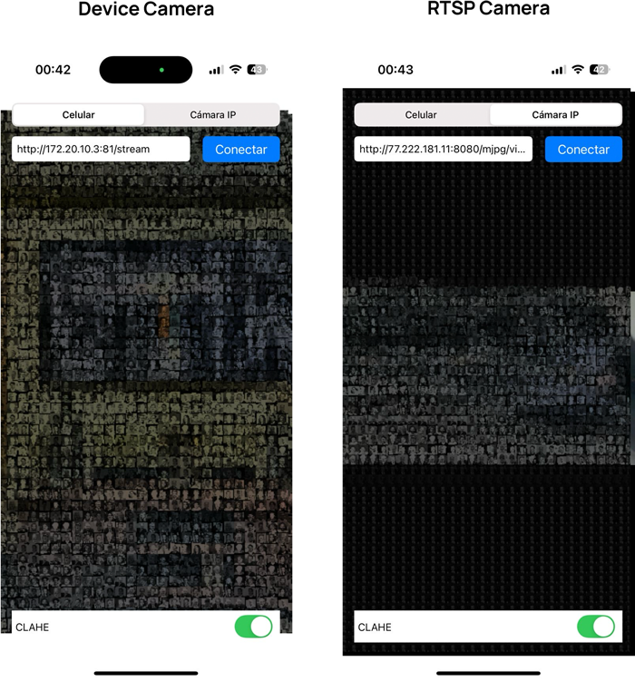

# iOS Swift OpenCV RTSP Image Processing
This repository contains a project designed to process frames captured from an RTSP camera connection and the device's camera, leveraging OpenCV and C++ compiled into native code. A simple filter is applied to the frames using OpenCV with C++, enabling image processing while facilitating interaction with Swift project files. These files are seamlessly integrated and used within the C++ code.


## Authors

- José Villalta - [@VillaltaJose](https://www.github.com/VillaltaJose)
- Daniel Collaguazo - [@DanielCollaguazo2003](https://www.github.com/DanielCollaguazo2003)


## Prerequisites

To run this project, you will need the following:

1. **OpenCV Framework for iOS and Swift:** OpenCV is required for image processing. You can download the appropriate version for iOS from the [OpenCV SourceForge page](https://sourceforge.net/projects/opencvlibrary/). Make sure to verify the compatibility of the version you select with your development environment.

1. **MobileVLCKit Framework:** MobileVLCKit is necessary for capturing RTSP streams. You can find the desired release version on the [MobileVLCKit artifacts page](https://artifacts.videolan.org/VLCKit/MobileVLCKit/). Ensure the version you choose aligns with your project requirements.## How It Works
### Swift Code Overview
The Swift code is located in the main view `OpenCV_UIKit/ViewController.swift`.

#### Key UI Elements  
The UI contains the following key components:  

- **Segment**: Determines whether the processed frame comes from the device's camera or the RTSP camera.  
- **TextField**: Used to input the URL for the RTSP camera stream.  
- **ImageViews**:  
  - `imageView`: Dedicated to displaying frames from the RTSP camera. Due to the functionality of the MobileVLCKit library, this `imageView` is used to render the RTSP stream (explained further below).  
  - `processedImageView`: Displays the frame processed by the OpenCV filter.  

#### Important Functions  
The following functions must be modified if you want to apply a different filter. At the end of each function, the frame is processed using OpenCV:  

1. **`captureOutput`**:  
   Processes frames from the device's camera.  

2. **`processCapturedFrame`**:  
   Processes frames from the RTSP camera.  
   Since MobileVLCKit does not provide a direct method to access frames, the RTSP content is first rendered in the `imageView`. The frame is then captured from this `imageView`, passed to OpenCV for processing, and the result is displayed in the `processedImageView`.  

---

### Connecting OpenCV and C++ with Swift  
To integrate OpenCV with Swift, a bridge is used to facilitate communication between the two environments. This bridge is implemented in the following files:  

- **`FilterApplicatorBridge.mm`**  
- **`FilterApplicatorBridge.h`**  

#### Header File (`FilterApplicatorBridge.h`)  
The header file defines the methods used in the bridge:  

```objective-c
#import <Foundation/Foundation.h>
#import <UIKit/UIKit.h>

@interface FilterApplicatorBridge : NSObject

- (UIImage *)apply_filter:(UIImage *)image;

- (void *)loadAndResizeImages:(NSArray<NSString *> *)imagePaths subFrameSize:(CGSize)subFrameSize;

- (void)releaseMat:(void *)matPtr;

- (UIImage *)apply_filter:(UIImage *)image useClahe:(int)useClahe withReferenceMat:(void *)referenceMatPtr;

@end
```

> Note: The `UIImage` type in Swift is converted to an OpenCV `Mat` type in C++.

#### C++ Class (`FilterApplicator.hpp`)
In C++, the methods defined in the bridge header are mapped to their equivalents in the `FilterApplicator` class:

```
#include <opencv2/opencv.hpp>

using namespace cv;
using namespace std;

class FilterApplicator {
public:
    bool loadAndResizeImages(const std::vector<std::string> &imagePaths,
                             std::vector<cv::Mat> *resizedImages,
                             cv::Size targetSize);
    
    Mat apply_filter(Mat image);
    
    Mat apply_filter(Mat image, int useClahe, void* referenceMatPtr);
};
```

#### Implementation File (`FilterApplicatorBridge.mm`)
The `FilterApplicatorBridge.mm` file implements the interfaces defined in the header file. It includes the critical conversion of a `UIImage` (Swift frame) to a `Mat` (OpenCV frame) using the function:

```
UIImageToMat(image, opencvImage, true);
```

This conversion allows frames from Swift to be processed in C++ with OpenCV and then returned to Swift for display.

### OpenCV Filter Implementation


## Usage/Examples
Below are screenshots showcasing the application in action on a physical device:  

- **Left**: Frame captured and processed using the **device camera**.  
- **Right**: Frame captured and processed using the **RTSP camera connection**.  

  
### Contributing  
Contributions to this project are welcome! Here’s how you can help:  

1. **Create a New Issue**: If you encounter any bugs, have feature requests, or suggestions for improvements, feel free to open a new issue in the repository.  
2. **Fork the Repository**: Make your own copy of the repository, implement your changes, and submit a pull request for review.  

#### Pending Tasks  
If you're looking for areas to contribute, here are some tasks currently in need of attention:  
- **Code Cleanup**: Refactor and improve the existing code for better readability and maintainability.  
- **Filter Optimization**: Enhance the performance and efficiency of the C++ filter implementation.  
