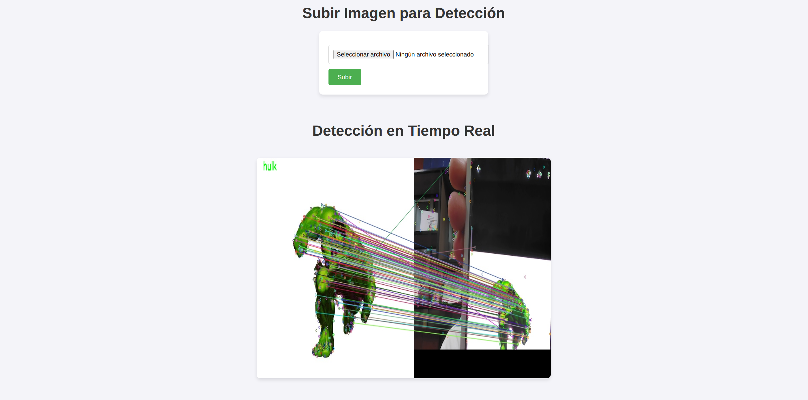

# **Video:** https://drive.google.com/file/d/1DnYcgxI0pi-IjzFDDxy0fnh70WqaE9pH/view?usp=sharing   
# **Final Report: Computer Vision Integrative Project**
## **Detection of STOP and Pedestrian Crossing Signs Using LBP and Cascade Classifier**
This project implements a traffic sign detection system, specifically **STOP** and **Pedestrian Crossing** signs, using the **Local Binary Patterns (LBP)** technique and training an **OpenCV Cascade Classifier**. A supervised learning model was developed to detect these symbols in real time from images or video.

Traffic sign recognition is a crucial task in computer vision, with applications in autonomous driving and assistive technologies. This project focuses on detecting **STOP** and **Pedestrian Crossing** signs using a **Cascade Classifier trained with Local Binary Patterns (LBP)**. 

The methodology involves:
- Dataset preparation using labeled images.
- Feature extraction with LBP.
- Training a cascade classifier with OpenCV.
- Real-time object detection with a webcam.

The goal is to develop a **lightweight and efficient model** that can detect these symbols in real-time under various conditions.

## Authors

- José Villalta - [@VillaltaJose](https://www.github.com/VillaltaJose)
- Daniel Collaguazo - [@DanielCollaguazo2003](https://www.github.com/DanielCollaguazo2003)


## Prerequisites

To run this project, you will need the following:

1. **OpenCV Framework for iOS and Swift:** OpenCV is required for image processing. You can download the appropriate version for iOS from the [OpenCV SourceForge page](https://sourceforge.net/projects/opencvlibrary/). Make sure to verify the compatibility of the version you select with your development environment.

1. **MobileVLCKit Framework:** MobileVLCKit is necessary for capturing RTSP streams. You can find the desired release version on the [MobileVLCKit artifacts page](https://artifacts.videolan.org/VLCKit/MobileVLCKit/). Ensure the version you choose aligns with your project requirements.## How It Works
### Swift Code Overview
The Swift code is located in the main view `OpenCV_UIKit/ViewController.swift`.

#### Key UI Elements  
The UI contains the following key components:  
  
- **Segment**: Determines whether the processed frame comes from the device's camera or the RTSP camera.  
- **TextField**: Used to input the URL for the RTSP camera stream.  
- **ImageViews**:  
  - `imageView`: Dedicated to displaying frames from the RTSP camera. Due to the functionality of the MobileVLCKit library, this `imageView` is used to render the RTSP stream (explained further below).  
  - `processedImageView`: Displays the frame processed by the OpenCV filter.  

#### Important Functions  
The following functions must be modified if you want to apply a different filter. At the end of each function, the frame is processed using OpenCV:  

1. **`captureOutput`**:  
   Processes frames from the device's camera.  

2. **`processCapturedFrame`**:  
   Processes frames from the RTSP camera.  
   Since MobileVLCKit does not provide a direct method to access frames, the RTSP content is first rendered in the `imageView`. The frame is then captured from this `imageView`, passed to OpenCV for processing, and the result is displayed in the `processedImageView`.
---

### **Dataset Used**
For training, we collected a total of **8,000 images**:
- **4,000 positive images** containing STOP and Pedestrian Crossing symbols, generated using **RoboFlow** and exported in **YOLO Darknet** format.
- **4,000 negative images** with various environments that do not include the target symbols.

### **Theoretical Background**
#### **Local Binary Patterns (LBP)**
LBP is a **texture descriptor** widely used in image classification and object detection. It encodes the **local structure of an image** by comparing each pixel with its surrounding neighbors.

##### **LBP Calculation:**
1. Select a **central pixel** in a `3×3` neighborhood.
2. Compare it with its 8 surrounding pixels.
3. Assign `1` if the neighbor is greater than or equal to the center, otherwise `0`.
4. Convert the binary sequence into a **decimal value**.

Example for a `3×3` window:


```

Thresholding: 120 135 150 115 130 140 → (Threshold with 130) 100 105 110

Binary Code: 0 1 1 0 (130) 1 → (01110100)₂ = 116 0 0 0

```

This process is repeated across the entire image to generate an **LBP feature map**, which is then used for classification.

#### **Cascade Classifier**
A **cascade classifier** is a machine learning algorithm based on **Haar-like features or LBP**. It works in **stages**, where simple classifiers are applied sequentially. If an object fails at any stage, it is immediately **discarded**, making the model **efficient**.

##### **Training Process:**
1. Extract features using **LBP** from **positive (signs) and negative (random scenes) images**.
2. Train weak classifiers using **Adaboost**.
3. Combine classifiers in a **cascade**, filtering out negatives progressively.
4. The final classifier is a **strong ensemble model** capable of real-time detection.

### **Dataset Preparation**
The dataset consists of **8,000 images**, split into:
- **4,000 positive samples** (STOP and Pedestrian Crossing signs).
- **4,000 negative samples** (random backgrounds without signs).

#### **Image Collection and Annotation**
- Positive images were generated using **RoboFlow** and exported in **YOLO Darknet** format.
- Negative images were manually collected from various environments.

#### **Sample Images**
Below are sample images from each category:

| **STOP Sign** | **Pedestrian Crossing Sign** |
|--------------|-----------------------------|
|  |  |
|  |  |

| **Negative Samples (No Signs)** |
|--------------------------------|
|  |
|  |

#### **Conversion to OpenCV Format**
Since OpenCV requires a specific format for training, we **converted YOLO annotations** into an OpenCV-compatible `.txt` file.

Command used to convert positive samples:
```
opencv_createsamples -info positives.txt -num 3900 -w 24 -h 24 -vec positives.vec
```

Command used for negative samples:

```
find ./DatasetNegative/ -iname "*.jpg" > dataset.txt
```

### **Training the Cascade Classifier**

The model was trained using `opencv_traincascade` with **LBP features**:

```
opencv_traincascade -data cascade/ -vec positives.vec -bg dataset.txt -numPos 3700 -numNeg 4000 -numStages 20 -w 24 -h 24 -featureType LBP

```

#### **Training Parameters**

-   `numPos 3700`: Number of positive samples used.
-   `numNeg 4000`: Number of negative samples used.
-   `numStages 20`: Number of training stages.
-   `featureType LBP`: Used LBP instead of Haar features.
-   `w 24 -h 24`: Resized all images to `24x24` pixels.

#### **Training Results**

-   The training reached **19 stages**, with a high **hit rate (HR)** and decreasing **false alarm rate (FA)**.
-   Achieved **>99% accuracy** on training data.

##### **Training Evolution Graphs**

-   **Detection Rate Evolution**  
    
    
-   **False Alarm Rate Evolution**  
    
    

## **Results and Evaluation**

The final system was tested under different lighting conditions and angles. **Detection results:**

-   **High accuracy in controlled environments**.
-   **Reduced false positives** due to **LBP robustness**.
-   **Real-time performance with low computational cost**.

### **Example Detection**

Below are two examples of object detection using the implemented system:

#### **Example 1**


#### **Example 2**


# **Image Detection with SIFT Using Flask and OpenCV**

## **Introduction**
This report presents the development of a **web-based image detection system** using **Flask** and **OpenCV**, leveraging the **Scale-Invariant Feature Transform (SIFT)** algorithm. The system aims to recognize a specific logo or symbol in user-provided images and real-time video streams.

Feature-based image detection is widely used in **computer vision**, **object recognition**, **augmented reality**, and **security applications**. SIFT is particularly useful due to its **invariance to scale, rotation, and lighting conditions**, making it a robust technique for detecting objects in complex environments.

## **Key Concepts**

### **Feature Extraction in Images**
Feature extraction is a fundamental step in image processing that involves detecting distinct points or patterns in an image. These features can include:

- **Edges**: Sharp changes in pixel intensity.
- **Corners**: Points where intensity gradients vary in multiple directions.
- **Textures**: Repetitive patterns that define an object’s surface properties.

SIFT extracts **keypoints** and generates unique **descriptors** for each feature, allowing for precise image comparison.

### **SIFT Algorithm**
SIFT is a **feature detection and description algorithm** developed by **David Lowe** in 1999. It is particularly advantageous for object recognition because it is **scale- and rotation-invariant**.

The SIFT process consists of four main steps:

1. **Keypoint Detection using Difference of Gaussian (DoG)**  
   Identifies candidate keypoints across multiple scales.
   
2. **Keypoint Localization**  
   Filters out unstable points and refines their positions.

3. **Orientation Assignment**  
   Determines the dominant gradient direction for each keypoint.

4. **Descriptor Generation**  
   Computes a 128-dimensional vector for each keypoint, enabling robust image matching.

Example of detected keypoints using SIFT:


---

### **Feature Matching**
Once keypoints are detected in both the **reference image** and the **input image**, they must be compared to establish a match.

**Brute-Force Matcher (BFMatcher)** is used for this purpose. It compares each descriptor from the reference logo with those from the input image and selects the closest matches.

Example of feature matching between two images:



### **Real-Time Video Detection**
One of the most powerful applications of this system is **real-time video detection**. The process follows these steps:

1. Capture a **frame** from the camera.
2. Convert it to **grayscale** for faster processing.
3. Extract **keypoints and descriptors** using SIFT.
4. Match the extracted features with those from the reference image using **BFMatcher**.
5. If a sufficient number of matches is found, keypoints are highlighted.
6. The processed frame is displayed in real time.

## **Results**
To evaluate the system's performance, multiple test images were analyzed under different conditions.

**1. Successful logo detection in a clear image:**  
   - The system accurately identified the reference logo.  
   - The detected keypoints were well-distributed across the object.  

**2. Partial detection in a noisy image:**  
   - The system detected some keypoints but struggled with occlusions.  
   - Matching accuracy decreased in low-contrast areas.  

Example of a detection result:


These results demonstrate that the algorithm is effective in most cases but can face challenges under **severe occlusions** or **extreme lighting variations**.

## **Conclusion**
This project successfully implemented a real-time detection system for **STOP** and **Pedestrian Crossing** signs using a **Cascade Classifier trained with LBP features**. The model demonstrated **high accuracy** and **low computational cost**, making it suitable for real-world applications. Despite challenges such as **false positives** and **lighting sensitivity**, the system performed well in controlled environments. Future improvements include **expanding the dataset**, **applying deep learning techniques (CNNs)** for enhanced robustness, and **developing a mobile application** for real-time deployment. This work highlights the potential of **traditional computer vision methods** for efficient and lightweight object detection.

This project successfully demonstrates the application of **SIFT-based image detection** in a Flask web application. The key takeaways include:

- **Feature-based object recognition using SIFT.**  
- **Efficient matching using BFMatcher.**  
- **Integration of real-time video processing within Flask.**  
- **Potential applications in security, authentication, and automation.**  

Despite its robustness, SIFT is computationally expensive. Future improvements could include:

- **Implementing ORB or SURF** for faster performance.  
- **Deep learning approaches** to enhance feature recognition.  
- **GPU acceleration** for real-time video processing.  

---

## **References**
- Lowe, D. G. (2004). "Distinctive Image Features from Scale-Invariant Keypoints". *International Journal of Computer Vision*.  
- OpenCV Documentation: [https://docs.opencv.org/](https://docs.opencv.org/)  
- Flask Documentation: [https://flask.palletsprojects.com/](https://flask.palletsprojects.com/)  

---


